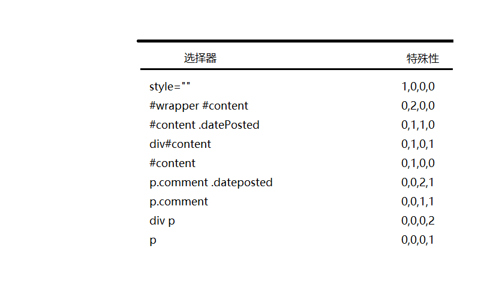
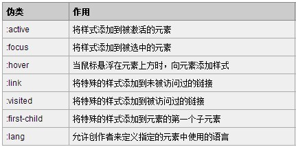
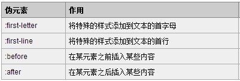

###层叠和特殊性
即使在不太复杂的样式表中,要寻找同一元素可能有两个或更多规则.CSS通过一个称谓`层叠(cascade)`的过程处理这种冲突.层叠给每个规则分配一个重要度

层叠采用以下重要度次序

- 标有`!important`的用户样式
- 标有`!important`的开发者样式
- 开发者样式
- 用户样式
- 浏览器/用户代理应用的样式

####特殊性
选择器的特殊性分成4个等级: a b c d

- 如果为`行内样式`,那么`a = 1`
- b等于`ID选择器`的总数
- c等于`类`/`伪类`/`属性选择器`的数量
- d等于`类型选择器`和`伪元素选择器`的数量



特殊性的计算,可以看做是"N进制"的数字,也就是说某个位置的数不管多大,都不会影响上一位

如果两个规则的特殊性相同,那么厚定义的规则优先

####解释
- 属性选择器: `h1[title]`,`input[type="text"]`

- 类型选择器也叫作元素选择器或简单选择器: `p{}`,`div{}`

- 伪类在我的理解就是在一个元素上根本没有添加某个类,但在css样式中却可以改变没有添加类的元素的样式



- 伪元素就是某个地方根本没有这个元素,但是却可以通过css来改变没有元素的某个地方的样式



伪元素和伪类之所以这么容易混淆,是因为他们的效果类似而且写法相仿,但实际上css3 为了区分两者,已经明确规定了`伪类用一个冒号`来表示,而`伪元素则用两个冒号`来表示

###样式表引入
在HTML文件中导入样式

- 链接式

`<link rel="stylesheet" href="test1.css">`

- 导入式

```
<style>
    @import url('test2.css')
</style>
```

在样式表中使用导入式

```
@import url(test2.css);

body{
    background-color: red;
}
```

最近的浏览器基准测试中已经表明,导入样式表比链接样式表速度要慢,所有建议使用链接样式表

**_在使用多个CSS文件时候,还有两个与速度相关的问题._**

**_首先,多个文件会导致从服务器发送更多数据包,这些数据包的数量(而不是内容)会影响下载时间_**

**_其次,浏览器只能从同一个域同时下载数量有限的文件.对于老式浏览器,这个限制常常只是两个文件,现代浏览器把这个限制提到了8个_**

由于以上原因,使用结构良好的单一CSS文件可以显著提高下载速度.

