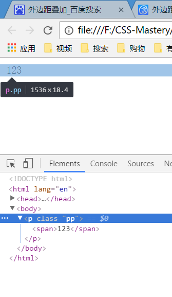
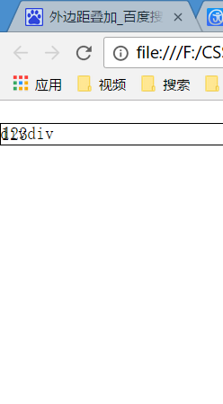
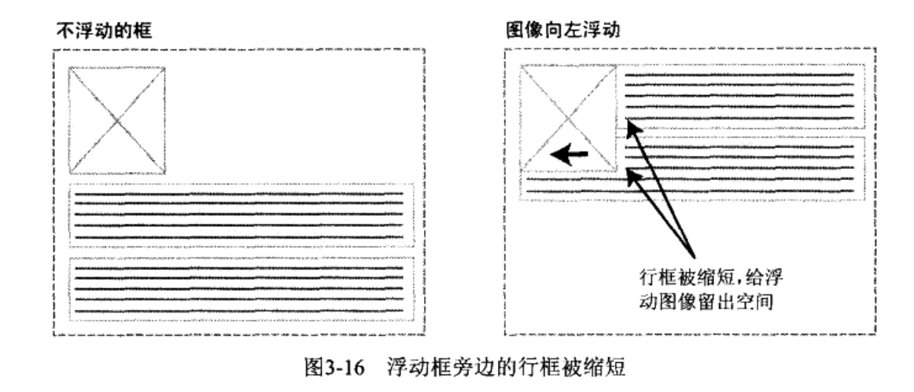

###IE怪异盒模型
在IE早期版本中,包括IE6,在混杂模式中使用自己的非标准盒模型.这些浏览器的width属性不是内容的宽度,而是`内容`,`内边距`,`边框`的宽度总和.在CSS3的`box-sizing`属性可以定义要使用哪种盒模型.

###外边距叠加
当一个元素包含在另一个元素中时(`假设没有内边距和边框将外边距隔开`),它们的顶和底部外边距会发生叠加

```html
<!DOCTYPE html>
<html lang="en">
<head>
    <meta charset="UTF-8">
    <title>Document</title>
    <style>
        *{
            padding: 0;
            margin: 0;
        }
        span{
            display: block;
            margin: 10px;
            padding: 0;
        }
    </style>
</head>
<body>
    <p class="pp">
        <span>123</span>
    </p>
</body>
</html>
```

这里p离页面顶部10px



假设有一个空元素,它有外边距,但是没有边框和内边距.在这种情况下,它的定外边距和底部外边距就碰到了一起,也会叠加

**_只有普通文档流中的块框的垂直外边距才会发生外边距叠加.行内框,浮动框,绝对定位框之间的外边距都是不会叠加的_**

####影响行内框的尺寸因素
在行内框没有被display: inline-block时,行内框可以使用水平内边距,边框和外边距调整它们的水平间距.但是,垂直内边距,边框和外边距不影响行内框高度(虽然可以被设置).在上述情况下,唯一可以增加行内框高度的方法就是设置行高

####相对定位
在使用相对定位时候,无论是否移动,元素仍然占据原来的空间.因此,移动元素会导致它覆盖其他框.也就是说,相对定位的元素无论移动不移动,原先的位置永远是他自己的,其他元素不会来占据.而如果相对定位的元素移动了,那么它会盖住其他元素(不是挤走其他元素)

```html
<!DOCTYPE html>
<html lang="en">
<head>
    <meta charset="UTF-8">
    <title>Document</title>
    <style>
        *{
            padding: 0;
            margin: 0;
        }
        .pp{
            border: 1px solid #000;
            position: relative;
            top: 20px;
            left: 0;
        }
    </style>
</head>
<body>
    <p class="pp">
        123
    </p>
    <div>divdiv</div>
</body>
</html>
```



####固定定位
固定定位是绝对定位的一种.差异在于固定元素的包含块是视口(viewport).这使我们能够创建总是出现在窗口中相同位置的浮动元素

####浮动
浮动会让元素脱离文档流,不再影响不浮动的元素.实际上,并不完全如此.如果浮动的元素后面有一个文档流中的元素,那么这个元素的框会表现的像浮动根本不存在一样.

**_但是,框的文本内容会受到浮动元素的影响,会移动以留出空间.用技术术语讲,浮动元素旁边的行框被缩短,从而给浮动元素留出空间,因此行框围绕浮动框_**

实际上,创建浮动框使得文本可以围绕图像,如下图



要想阻止行框围绕在浮动框的外边,需要对包含这些行框的元素应用`clear属性`.clear属性的值可以是: `left`,`right`,`both`,`none`,它表示框的哪些边不应该挨着浮动框

在使用完clear以后,使得浮动框独占一行

详见[float.html](float.html)