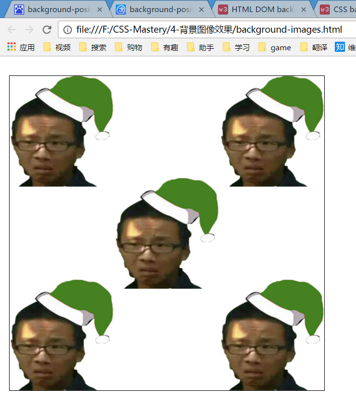
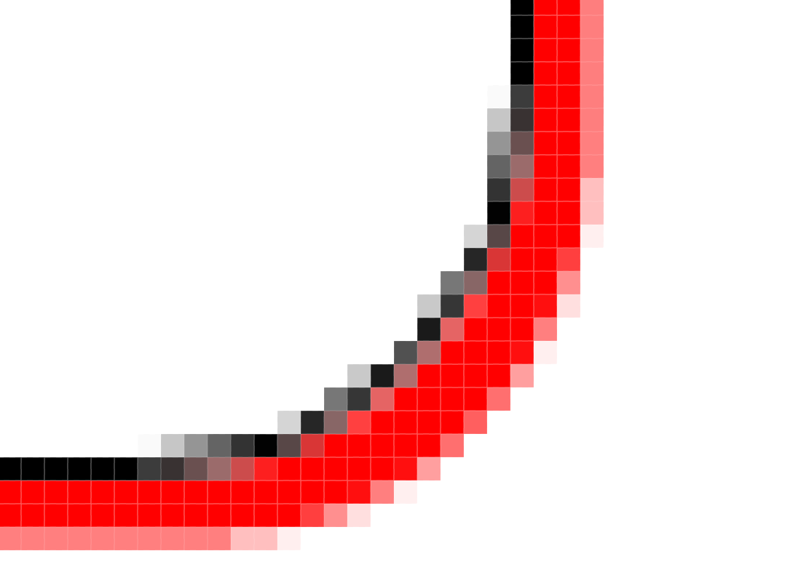

####background-position
使用像素进行背景定位是图像左顶点与容器左顶点进行比较.

而使用百分数进行背景定位就不一样了.百分数定位并不对背景图像的左上角进行定位,而是使用图像上的一个对应点.所以,如果指定垂直和水平位置都是20%,那么实际上是在图像上距离左上角20%的点定位到容器距离左上角20%的位置

上述的话就是说图像里有一个相对图像左上角的横竖20%的点和容器里有一个相对容器左上角横竖20%的点,这两个点重合起来.这就是百分数定位背景图的工作原理

如`background-position: 50% 50%;`就是图像的水平垂直中点与容器的水平垂直中点重合,相当于`background-position: center center;` 

使用百分比的时候,图像左上角到容器左上角的位移计算方式: 

X = (容器宽 - 图像宽) * 百分数 (超出容器部分隐藏)

Y = (容器高 - 图像高) * 百分数 (超出容器部分隐藏)

规范指出,不要讲像素或百分数等单位与关键字混合使用.但许多现代浏览器故意忽略了这个规则.因此最好不要混合使用单位和关键字

####多个背景图像
在CSS3中实现了多个背景图像同时存在于同一个容器内.

```html
<!DOCTYPE html>
<html lang="en">
<head>
    <meta charset="UTF-8">
    <title>Document</title>
    <style>
        .box{
            width: 500px;
            height: 500px;
            border: 1px solid #000;
            margin: 100px auto;
            background-image: url('img/green3.jpg'),url('img/green3.jpg'),url('img/green3.jpg'),url('img/green3.jpg'),url('img/green3.jpg');
            background-repeat: no-repeat,no-repeat,no-repeat,no-repeat;
            background-position: top left,top right,50%,bottom left,bottom right;
        }
    </style>
</head>
<body>
    <div class="box"></div>
</body>
</html>
```

详细见[background-images.html](background-images.html)



支持IE9+

####box-shadow
CSS3实现了投影的技术,使用`box-shadow`属性.该属性需要4个值: 水平偏移,垂直偏移,投影宽度(也就是模糊程度)和颜色

例子

```html
<!DOCTYPE html>
<html lang="en">
<head>
    <meta charset="UTF-8">
    <title>Document</title>
    <style>
        .box{
            width: 500px;
            height: 500px;
            border: 1px solid #000;
            margin: 100px auto;
            border-radius: 20px;
            box-shadow: 3px 3px 0 red;
        }
    </style>
</head>
<body>
    <div class="box"></div>
</body>
</html>
```

上述代码的效果

