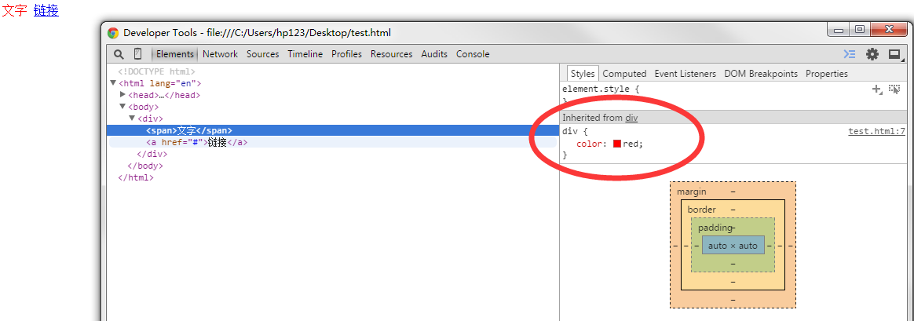
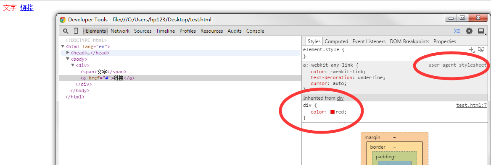

a标签伪类顺序: `a:link`,`a:visited`,`a:hover`,`a:focus`,`a:active`

###锚点链接
- 使用id定位,这种定位可以运用于任何标签

```html
<!DOCTYPE html>
<html lang="en">
<head>
    <meta charset="UTF-8">
    <title>Document</title>
    <style>
        a{
            display: block;
            margin-bottom: 2500px;
        }
        p{
            color: #f00;
        }
    </style>
</head>
<body>
    <a href="#target">pp12313</a>
    <p id="target">pp123123</p>
</body>
</html>             
```

- 使用name定位,这种定位只能是a标签

```html
<!DOCTYPE html>
<html lang="en">
<head>
    <meta charset="UTF-8">
    <title>Document</title>
    <style>
        a[href="#target"]{
            display: block;
            margin-bottom: 2500px;
        }
        a[name]:target{
            color: #f00;
        }
    </style>
</head>
<body>
    <a href="#target">pp12313</a>
    <a name="target">aa123123</a>
</body>
</html>   
```

以上两段代码中的target是伪类,当点击了锚点标记以后,页面不仅会跳到目标点,而且目标点还会变色

除了在一个页面中的部门跳转之外,还能跳转不同页面的不同部位

```html
<a href="http://www.xxx.com/target.html#comment">
    comment
</a>
```

以上代码会跳转到xxx域名下的target页面的comment部分

####a标签样式
CSS 中 a 标签为什么不能继承父类的颜色？

```html
<style>
    div{ color: red; }
</style>
<div>
  <span>文字</span>
  <a href="#">链接</a>
</div>
```

其实就是a的浏览器默认样式里有带有伪类.其特异性值是 `[0,0,1,1] `,直接设置 div 的是 `[0,0,0,1]`,无法覆盖。

由于CSS的层叠,a元素继承自div的样式被浏览器的a元素的默认样式给覆盖了





由以上两个图可以知道：

- 浏览器本身对a元素有默认样式（user agent stylesheet）（图二），对span元素没有默认样式（图一）

- 由于CSS的层叠，a元素red颜色继承自div（Inherited from div）被划掉了（图二）


