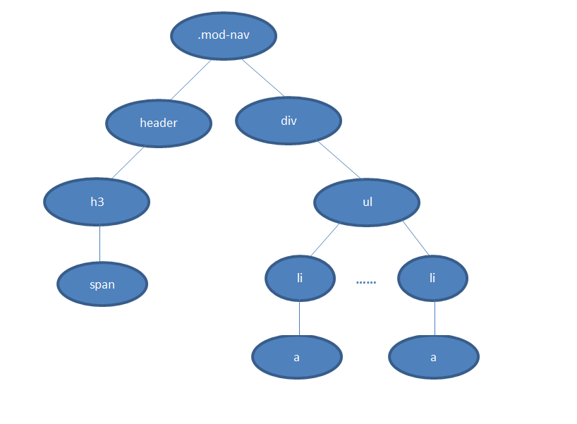

###编写高性能CSS
本文是对下面链接地址的文章`Writing efficient CSS selectors` 进行的学习和归纳

[https://csswizardry.com/2011/09/writing-efficient-css-selectors/](https://csswizardry.com/2011/09/writing-efficient-css-selectors/)

####CSS选择器对css性能的影响

css选择器本身具有固定的性能上的高低,以下是css选择器性能由高到低的排序

- ID选择器, e.g. #header
- Class选择器, e.g. .promo
- 元素选择器(Type), e.g. div
- 相邻兄弟选择器(Adjacent sibling), e.g. h2 + p
- 子元素选择器(Child), e.g. ul > li
- 后代选择器(Descendant), e.g. ul a
- 通配符选择器(Universal), i.e. *
- 属性选择器(Attribute), e.g. [type="text"]
- 伪类/伪元素选择器(Pseudo-classes/-elements), e.g. a:hover

虽然ID选择器的回流速度是最快的,但`class`选择器也只比`ID`选择器差一线罢了,并不慢多少

元素选择器和后代选择器就比id选择器和class选择器的回流速度差多了.但元素选择器和后代选择器两者相比回流速度又是差不多的

可以把id选择器和class选择器分在同一个层次,把元素选择器和后代选择器分在同一个层次.当然层次之间有差距(差距较大),层次里面也有差距(差距较小)

####关联选择器
在实际生产中,我们并不会简单的只写一个选择器,而是根据生产需要,写出关联选择器. e.g. .content h1

在我们编写代码的时候,为了语义化,为了让自己更好的理解,所以我们对上述例子(.content h1)的理解是找到class为content下的h1元素进行样式的添加

就是说我们对于关联选择器是从左往右读的,**_而CSS选择器的读取顺序是从右向左_**

还是上面的关联选择器,它的读取顺序变成: 先找到所有的h1,沿着h1的父元素查找content,中途找到了符合匹配规则的节点就加入结果集;如果直到根元素html都没有匹配,则不再遍历这条路径,从下一个h1开始重复这个过程(如果有多个最右节点为h1的话)

为什么从右向左的规则要比从左向右的高效?



假如DOM的结构如上图,匹配规则是.mod-nav h3 span.

若从左向右的匹配,过程是：从.mod-nav开始,遍历子节点header和子节点div,然后各自向子节点遍历.在右侧div的分支中,最后遍历到叶子节点a,发现不符合规则,需要回溯到ul节点,再遍历下一个li-a,假如有1000个li,则这1000次的遍历与回溯会损失很多性能.

再看看从右至左的匹配：先找到所有的最右节点span,对于每一个span,向上寻找节点h3,由h3再向上寻找class=mod-nav的节点,最后找到根元素html则结束这个分支的遍历.

很明显,两种匹配规则的性能差别很大.之所以会差别很大,是因为从右向左的匹配在第一步就筛选掉了大量的不符合条件的最右节点(叶子节点);而从左向右的匹配规则的性能都浪费在了失败的查找上面.

当然这是比较明显情况,如果在叶子上存在多个不符合条件的span,从右向左的规则也会走一些弯路(这时就需要优化CSS选择器了).但平均来说它还是更高效,因为大多时候,一个DOM树中,符合匹配条件的节点(如.mod-nav h3 span)远远远远少于不符合条件的节点.

jQuery从1.3版本开始使用的Sizzle引擎,它按照了CSS选择器的匹配规则(从右至左)进行DOM元素的查找与匹配(当然其中做了很多优化),性能得到了很大的提升.

上述转载自[http://www.cnblogs.com/zhaodongyu/p/3341080.html](http://www.cnblogs.com/zhaodongyu/p/3341080.html)

####关键的选择器
通过了解上面关联选择器的知识,我们知道css选择器读取顺序是从右向左的.所以,在关联选择器中,最右边的那个选择器将是决定关联选择器性能高低的决定因素

比如以下两个关联选择器的例子,明眼人一看就知道第二个关联选择器的性能更高

```html
<style>
    #social a{}
</style>

<ul id="social">
    <li><a href="#" class="twitter">Twitter</a></li>
    <li><a href="#" class="facebook">Facebook</a></li>
    <li><a href="#" class="dribble">Dribbble</a></li>
    <li><a href="#" class="gplus">Google+</a></li>
</ul>
```

```html
<style>
    #social .social-link{}
</style>

<ul id="social">
    <li><a href="#" class="social-link twitter">Twitter</a></li>
    <li><a href="#" class="social-link facebook">Facebook</a></li>
    <li><a href="#" class="social-link dribble">Dribbble</a></li>
    <li><a href="#" class="social-link gplus">Google+</a></li>
</ul>
```

如果其他地方没有`social-link`,我们甚至可以撇去关联选择器`#social .social-link{}`,而通过直接写`social-link{}`

####限定关联选择器的个数
关联选择器应该简洁明了,个数能少写就应该少写

`#nav li a {}`在条件允许的情况下,应该改为`#nav a {}`

####反思和体悟
在平常写css的时候,我们兴许注意到css关联选择器不要写太多,既不美观,又影响性能,而且限制了重用性

但是当我们在css预处理器中写css的样式的时候,基本就把上述影响性能的因素抛诸脑后了.以为万事大吉了.这完全是一种非常小白的行为

关联选择器写3层已经够多了.至于怎么高效命名css,可以参考以下文章

[http://www.zhangxinxu.com/wordpress/2010/09/%E7%B2%BE%E7%AE%80%E9%AB%98%E6%95%88%E7%9A%84css%E5%91%BD%E5%90%8D%E5%87%86%E5%88%99%E6%96%B9%E6%B3%95/](http://www.zhangxinxu.com/wordpress/2010/09/%E7%B2%BE%E7%AE%80%E9%AB%98%E6%95%88%E7%9A%84css%E5%91%BD%E5%90%8D%E5%87%86%E5%88%99%E6%96%B9%E6%B3%95/)


